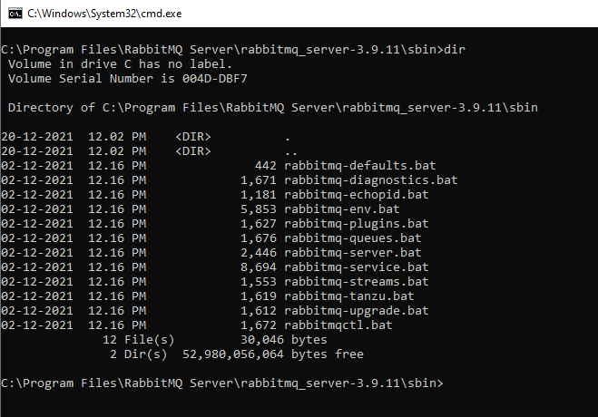
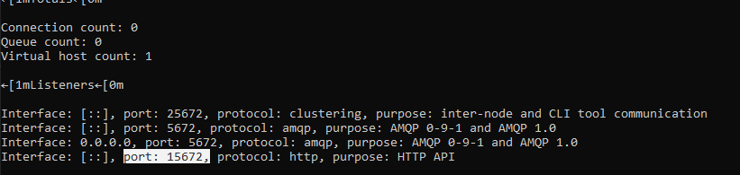
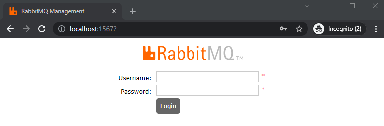
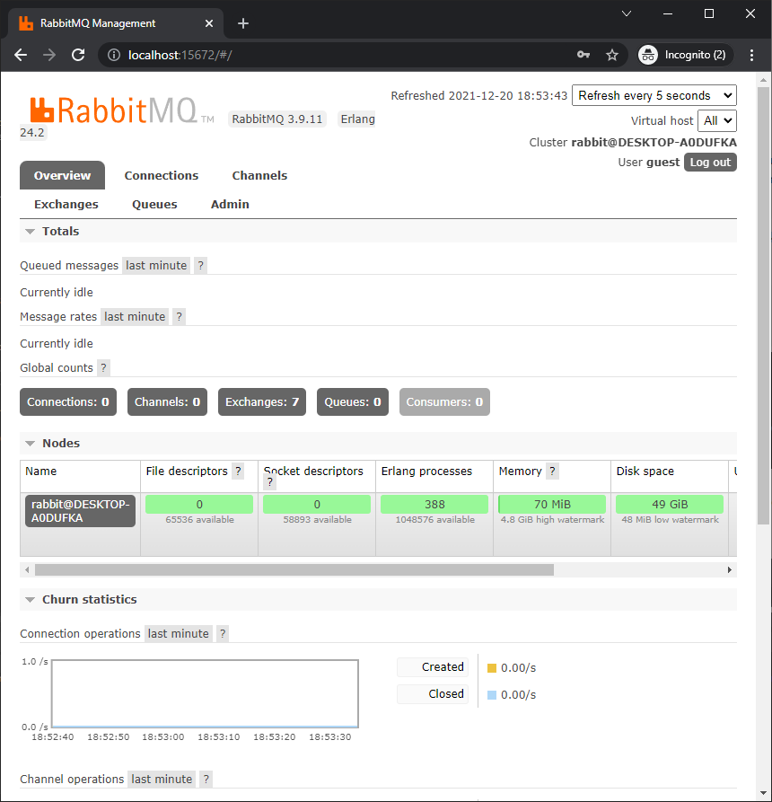

### Welcome to the demo of RabbitMQ using C#!
RabbitMQ, one of the most popular open source message broker. This will demonstrate RabbitMQ’s basics, by creating a simple RabbitMQ producer and consumer in .NET Core with C#.

# Configuration/Installation
Full documentation is available @[RabbitMQ website](https://www.rabbitmq.com/download.html)

For quick reference
Erlang is prerequisite. Download latest version of @[Erlang](https://www.erlang.org/downloads) and install 

Download latest version of @[RabbitMQ](https://www.rabbitmq.com/install-windows.html#installer)

If you follow the default installation "C:\Program Files\RabbitMQ Server\rabbitmq_server-3.9.11\"

Navigate to the directory using command prompt and list the content of sbin directory




Here you have set of bat files to mange the RabbitMQ server

```<powershell>
//TO check the status of server
C:\Program Files...\sbin>rabbitmqctl status

//TO start the service
C:\Program Files...\sbin>rabbitmq-service start

//TO stop the service
C:\Program Files...\sbin>rabbitmq-service stop

//By default web UI plugins are not enabled, we can do that using
C:\Program Files...\sbin>rabbitmq-plugins enable rabbitmq_management

```

Once the `rabbitmq_management` plugin is enabled, we should check which port it's running on and that can be done using
```<powershell>
//TO check the status of server
C:\Program Files...\sbin>rabbitmqctl status
```


If we see HTTP API port as shown in above image then we can access the same using browser `http:\\localhost:15672\`


We can use default credentials as `Username: guest` and `Password:guest`


